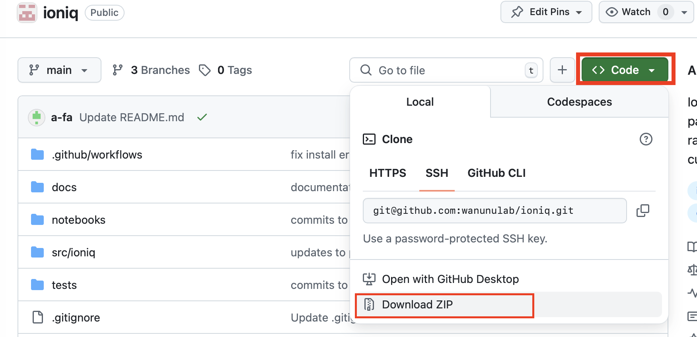
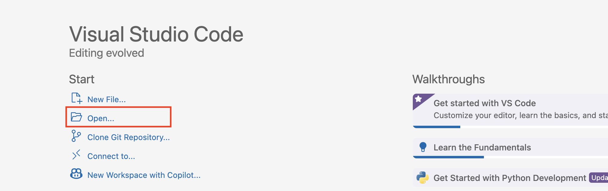
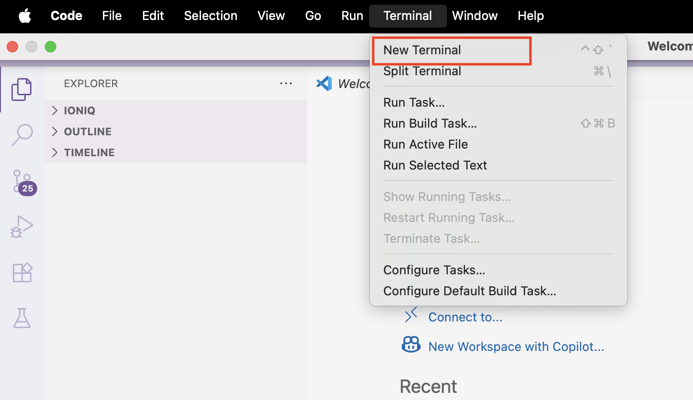

# Install Ionique

This guide walks you through the steps to download, set up, and install the Ionique package using a virtual environment.

---

## 1. Download the Ionique Repository

- Open the WanunuLab GitHub repository:  
  https://github.com/wanunulab/ionique

- Click the green **Code** button and choose **Download ZIP**.



- Unzip the folder and move it to your desired location (e.g., Desktop or Documents).

---

## 2. Open the Ionique Folder in VS Code

- Launch the **VS Code** application.
- Click **File > Open...** and select the unzipped `ionique` folder.



Now your working directory in VS Code is set to the `ionique` folder.

---

## 3. Set Up a Virtual Environment

A **virtual environment** is an isolated workspace for installing project-specific dependencies.

> Learn more: [Python Virtual Environments](https://docs.python.org/3/tutorial/venv.html)

### Step 1: Open Terminal in VS Code

- Go to the **top menu** and click **Terminal > New Terminal**.



### Step 2: Confirm You're in the Correct Directory

Use the following command:

```bash
ls
```

You should see the contents of the `ionique` folder.


### Step 3: Create and Activate the Environment

Run the command:

```bash
python -m venv ionique_env
```
> **Note:** On some systems (especially Linux/macOS), you may need to use `python3` and `pip3` instead of `python` and `pip`.

Then activate it:

- **Linux / macOS:**
  ```bash
  source ionique_env/bin/activate
  ```

- **Windows:**
  ```bat
  ionique_env\Scripts\activate
  ```

If activated successfully, you’ll see `(ionique_env)` appear before your username in the terminal.


---

## 4. Install the Ionique Package

Run the command:

```bash
pip install .
```

Wait a few minutes while dependencies install.


> If you see a similar message, congratulations — you've successfully installed the Ionique package!

---

## 5. (Optional) Install JupyterLab

To run data analysis in an interactive interface like Jupyter Notebook, install JupyterLab while the virtual environment is still active:

```bash
pip install jupyterlab
```

---

## 6. Deactivate the Environment

When you're done, deactivate the virtual environment by typing:

```bash
deactivate
```

> It's good practice to **activate** your virtual environment when working on a project and **deactivate** it when you're finished.
