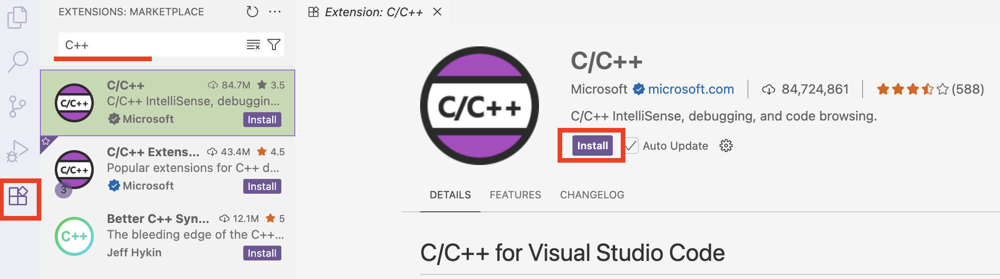
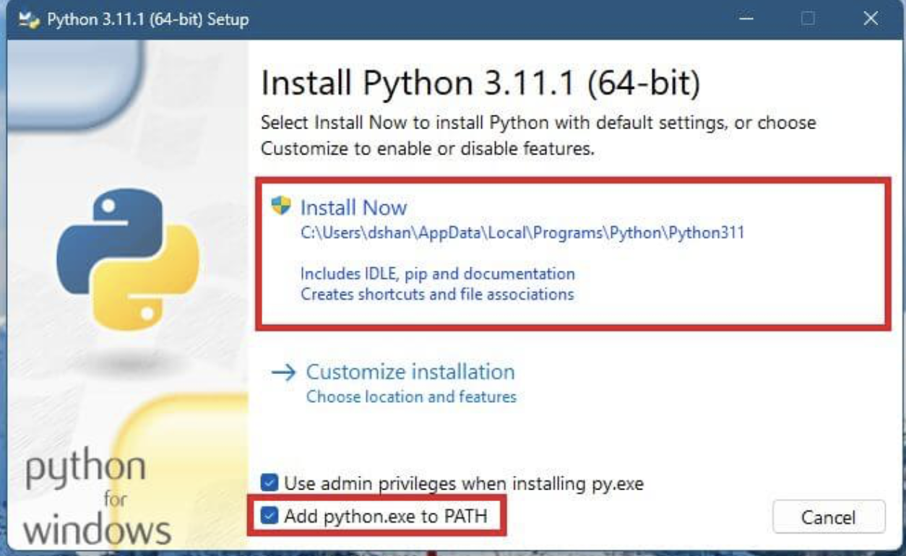

# Guide for VSCode and Python Installation

This guide is designed for users who do not have Python or Visual Studio Code installed on their machine.

> **Note:** The guide is divided into three parts: **Windows**, **Linux** and **macOS** users. Please follow the appropriate instructions for your operating system.

---

First, you need a platform (Integrated Development Environment) to run Ioniq. **Visual Studio Code (VS Code)** is a convenient IDE to start with.

---

## Installing VS Code

---

<details>
<summary><strong>Windows Users</strong></summary>

### 1. Install VS Code

- Go to the [VS Code website](https://code.visualstudio.com/), download.
- Run the installer.
- On the first screen, **check the boxes Add Python to PATH and Register code ...**.

- Finish installation.

### 2. Install Required Extensions

A few package requirements include C++ extensions and compilers.

- Open VS Code.
- Click the **Extensions** icon on the left sidebar.
- Find and install the extension shown below:



### 3. Install Compilers (Build Tools)

- Visit the [Visual Studio Downloads](https://visualstudio.microsoft.com/downloads/) page.
- Scroll down to **All Downloads** > **Tools for Visual Studio**.
- Download **Build Tools for Visual Studio 2022**.


- Run downloaded Installer.
- In the dialog, check the **Desktop development with C++** workload and click **Install**.


### 4. Install Python. 
#### *Skip this step if you already have Python!*

- Visit [Python Downloads for Windows](https://www.python.org/downloads/windows/).
- Choose a version between **3.10 and 3.12** and download.
- Run the installer.
- On the first screen, **check the box for "Add Python to PATH"**.
- Click **Install Now**.



</details>

---

<details>
<summary><strong>Linux Users</strong></summary>

### 1. Download and Install VS_Code

- Go to the [VS Code download page](https://code.visualstudio.com/download).
- Download the `.deb` package.

### 2. Open a Terminal

You can search for "shell" or use the shortcut `Ctrl + Alt + T`.

Check your current location:

```bash
pwd
```

Navigate to the Downloads folder (or wherever you saved the `.deb` file):

```bash
cd <DIRECTORY_NAME>
```

List files to confirm:

```bash
ls
```

Install VS Code:

```bash
sudo dpkg -i code_1.XXX.deb
```

> Replace `code_1.XXX.deb` with the actual filename.

### 3. Install Python
#### *Skip this step if you already have Python!*

- Visit the [Python Downloads page](https://www.python.org/downloads/).
- Download a version between **3.10 and 3.12**.
- Use your package manager or install from source.

For Ubuntu-based systems:

```bash
sudo apt update
sudo apt install python3.XX 
```
> Replace `XX` with a version here

</details>

---

<details>
<summary><strong>macOS Users</strong></summary>

### 1. Install VS Code

- Download VS Code for Mac from [here](https://code.visualstudio.com/Download).
- Open your browser’s download list and find the installer.
- If it's a `.zip` archive, extract the contents by double-clicking.
- Drag `Visual Studio Code.app` into your **Applications** folder.
- Open VS Code from the Applications folder or Launchpad.

### 2. Install Python
#### *Skip this step if you already have Python!*
- Visit the [Python Downloads page](https://www.python.org/downloads/).
- Choose a version between **3.10 and 3.12**.
- Double-click the downloaded `.pkg` file to launch the installer.
- Follow the on-screen steps. The default settings are usually sufficient.
- You may be asked to enter your Mac password during installation.

</details>

